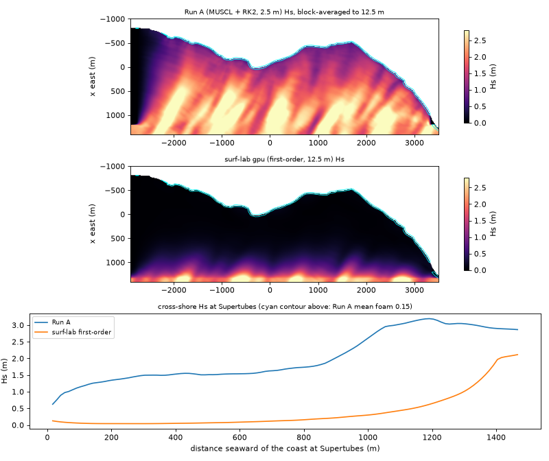

# J-Bay parity

The reference is **Run A** (`zulzi-gpu:~/surf-sim/out/A4-full/`): MUSCL-MC + SSP-RK2
HLL/Audusse NSWE at 2.5 m (960 x 2560), directional JONSWAP Hs 2.5 m, Tp 15 s,
gamma 3.3, cos^20 spread about theta0 = 150 deg, 8 min spin-up, 120 s record at 10 Hz.
Run A's fields are not in this repo; the scripts below read them in place.

Measured 2026-10-09 on zulzi-gpu (RTX 4090, Chrome 1228 headless, WebGPU over Vulkan).

## 1. Bathymetry: exact

`bathyFromPolyline(JBAY.coast, grid, JBAY_RECIPE)` against Run A's `depth.f32`:

| comparison | cells | max error | RMS error |
|---|---|---|---|
| full resolution, 960 x 2560 at 2.5 m, vs `depth.f32` | 2 457 600 | **0 m** | **0 m** |
| Run C grid 192 x 512, `supersample: 5`, vs 5 x 5 block mean of `depth.f32` (as `build_demo.py`) | 98 304 | **0 m** | **0 m** |
| Run C grid, cell-centre sampling (default), vs the same block mean | 98 304 | 7.04 m (0.92 m wet) | 0.032 m (0.0055 m wet) |

The cell-centre case differs only where the depth is not linear inside a 12.5 m
cell: 11 cells differ by more than 10 cm, all beyond the south end of the
polyline at (-819, -2894) where the signed distance changes sign. Build time:
20 ms at the cell centre, 470 ms supersampled, 490 ms at full resolution (Bun,
one core). `build_demo.py` also rounds to int16 centimetres; that 5 mm
quantisation is not reproduced.

Reproduce: `bun scripts/bathy-parity.ts` (reads `~/surf-sim/out/A4-full/depth.f32`)
and `bun test` (uses the committed 350 KB fixture of the block mean).

## 2. Wave fields: the first-order port does not carry the swell to the coast

Setup: the module on the Run C grid (192 x 512 at 12.5 m, dt 0.12 s, Manning
0.025, Run C wavemaker and sponges, Run C's loosened breaking thresholds) with
Run A's swell (`JBAY_RUN_A_SWELL`: JONSWAP Hs 2.5, Tp 15, gamma 3.3, cos^20, from
120 deg; 209 components, as in Run A, with wavenumbers set at the wavemaker band's mean depth of 26.4 m where Run A used 22.5 m). Spin-up 480 s, then statistics on every step for 120 s
(1000 samples). Run A's statistics were computed per 2.5 m cell over its 1201
frames and block-averaged to the same grid. "Interior" excludes both runs'
wavemaker bands (x > 1150 m) and sponges (y < -2650 m, y > 3250 m) and cells
shallower than 0.3 m.

The 4090 ran the 600 s of model time (5000 steps) in 0.32 s (15 600 steps/s,
about 1900 x real time). The CPU twin took 54 s and agrees with the GPU to
9e-7 m RMS in Hs (1.2e-5 m in depth after 300 steps from rest).

### Hs by depth band (m)

| depth band | cells | Run A | surf-lab | ratio | RMS diff | r |
|---|---|---|---|---|---|---|
| 0.3 to 3 m | 2998 | 0.90 | 0.07 | 0.08 | 0.86 | 0.17 |
| 3 to 6 m | 3353 | 1.17 | 0.05 | 0.04 | 1.16 | 0.48 |
| 6 to 10 m | 4458 | 1.30 | 0.04 | 0.03 | 1.32 | 0.59 |
| 10 to 15 m | 14360 | 1.57 | 0.06 | 0.04 | 1.58 | 0.49 |
| 15 to 20 m | 12925 | 2.01 | 0.14 | 0.07 | 1.95 | 0.50 |
| 20 to 40 m | 14846 | 2.30 | 0.44 | 0.19 | 1.97 | 0.31 |
| all interior | 52940 | 1.80 | 0.18 | 0.10 | 1.72 | 0.54 |

### Cross-shore Hs at Supertubes (m)

| seaward of coast | depth | Run A | surf-lab |
|---|---|---|---|
| 25 m | 1.0 m | 0.75 | 0.11 |
| 50 m | 1.9 m | 0.97 | 0.08 |
| 100 m | 3.6 m | 1.15 | 0.05 |
| 200 m | 7.2 m | 1.35 | 0.04 |
| 300 m | 10.3 m | 1.49 | 0.04 |
| 500 m | 13.0 m | 1.51 | 0.07 |
| 800 m | 17.2 m | 1.74 | 0.16 |
| 1100 m | 21.3 m | 3.03 | 0.44 |
| 1300 m | 24.1 m | 3.04 | 1.03 |

### Breaking line per named section

Most seaward cell in the section's row with time-mean foam above 0.15 (the
contour `a4_validate.py` draws as the break line), as distance seaward of the
section's coast point and the still-water depth there.

| section | Run A | surf-lab |
|---|---|---|
| Kitchen Windows | 12 m, 0.5 m deep | 0 m, 0.1 m deep |
| Magnatubes | 9 m, 0.3 m | none |
| Boneyards | 32 m, 0.8 m | -5 m, 0.1 m |
| Supertubes | 17 m, 0.5 m | 4 m, 0.1 m |
| Impossibles | 13 m, 0.6 m | 1 m, 0.1 m |
| Tubes | 21 m, 0.6 m | none |
| The Point | 16 m, 0.5 m | none |
| Albatross | 14 m, 0.5 m | none |

### Foam coverage

| metric (interior) | Run A | surf-lab |
|---|---|---|
| cells with mean foam > 0.15 | 1.18 % | 0.02 % |
| mean foam, depth < 5 m | 0.046 | 0.001 |
| share of time foam > 0.15, depth < 5 m | 7.4 % | 0.1 % |
| share of time foam > 0.15, depth < 1.5 m | 28.6 % | 0.2 % |

### Long-shore Hs along the 3 m isobath, Supertubes +/- 800 m

Run A averages 1.12 m along the isobath (range 0.88 to 1.51, highest at
Boneyards, -400 m). surf-lab averages 0.075 m (ratio 0.067), and the two
profiles are anti-correlated (r = -0.66): what little reaches the 3 m line in
surf-lab is noise from the strongest offshore crests, not refraction over the
reef. Per-100 m values: `scripts/parity_compare.py` output.

Mean water level is the one thing that matches: interior set-up 2.6 cm in
surf-lab against 2.1 cm in Run A.



### What matches and what does not

The bathymetry is exact, the GPU kernels match their CPU twin to rounding, and
the module reproduces Run C faithfully (`docs/img/runc-original-t420.png` is the
original demo, `docs/img/sim-firstorder-t390.png` the port, same picture). The
wave field does not match Run A. Numerical diffusion is the cause, not a porting
error: a first-order HLL scheme damps a linear wave like a diffusion of about
`c dx / 2`, so its amplitude e-folds over a distance of about `L^2 / (2 pi^2 dx)`.
For the 15 s peak at 25 m depth (L = 235 m) and dx = 12.5 m that is about 265 m.
The flat-bed probe (`scripts/decay-probe.ts`, pinned by a test) measures
0.46 m -> 0.19 m -> 0.08 m -> 0.03 m at 0, 250, 500 and 750 m from the
wavemaker. The J-Bay wavemaker is 1.3 to 1.5 km from the shore, and in shallow
water the wavelength shrinks and the e-folding distance with it (about 45 m at
5 m depth), so roughly 3 to 7 % of Run A's height arrives at the surf zone and
nothing breaks. The "foam" that Run C and this port show is a fringe of cells
at the waterline where `eta / h` exceeds 0.22 in a few centimetres of water,
not a break line; Run A breaks 10 to 30 m seaward of the coast in 0.3 to 0.8 m
of water (late for a 1.1 m wave: NSWE without dispersion turns waves into bores
rather than plunging). Run C's own report called its foam band a visual; these
numbers show it was never a break line.

To make the browser solver match Run A in kind, the scheme needs second-order
reconstruction (Run A's MUSCL-MC + SSP-RK2), which cuts the diffusion to a
third-order term; see "MUSCL/RK2" in HANDOVER.md. Refining the first-order grid
is not a way round it: at 2.5 m (Run A's grid, 25x the cells and 5x the steps)
the probe still loses 17 % per 250 m.

## Reproduce

```sh
export PATH=$HOME/.bun/bin:$PATH
bunx vite dev --host 127.0.0.1 --port 5181          # or the surflab-dev tmux session
bun scripts/parity-gpu.ts 480 120                    # GPU via headless Chrome -> parity-out/gpu.json
bun scripts/parity-cpu.ts 480 120                    # CPU twin -> parity-out/cpu.json
.venv/bin/python scripts/runa_stats.py               # Run A -> parity-out/runA.npz (22 s)
.venv/bin/python scripts/parity_compare.py parity-out/gpu.json --plots docs/img
```

The venv needs `numpy zstandard matplotlib` (`uv venv .venv`; this box has no
`ensurepip`).
