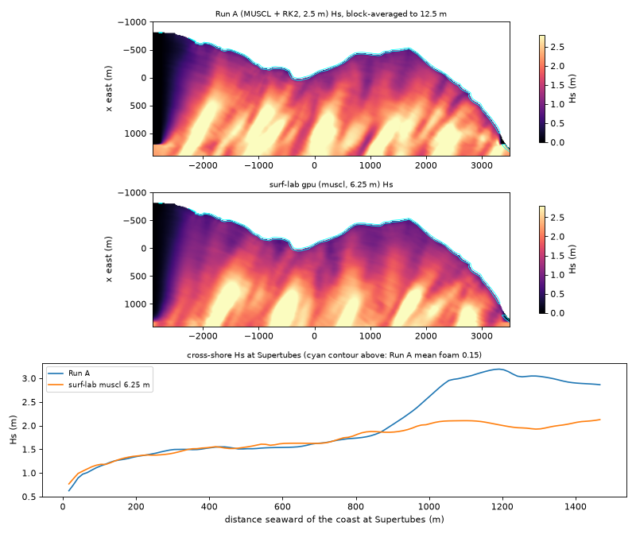

# J-Bay parity

The reference is **Run A** (`zulzi-gpu:~/surf-sim/out/A4-full/`): MUSCL-MC + SSP-RK2
HLL/Audusse NSWE at 2.5 m (960 x 2560), directional JONSWAP Hs 2.5 m, Tp 15 s,
gamma 3.3, cos^20 spread about theta0 = 150 deg, 8 min spin-up, 120 s record at 10 Hz.
Run A's fields are not in this repo; the scripts below read them in place.

Measured 2026-10-09 on zulzi-gpu (RTX 4090, Chrome 1228 headless, WebGPU over Vulkan).
Section 2 was rewritten after MUSCL/RK2 went in; the first-order numbers are
the original measurement, rerun with the same result.

## 1. Bathymetry: exact

`bathyFromPolyline(JBAY.coast, grid, JBAY_RECIPE)` against Run A's `depth.f32`:

| comparison | cells | max error | RMS error |
|---|---|---|---|
| full resolution, 960 x 2560 at 2.5 m, vs `depth.f32` | 2 457 600 | **0 m** | **0 m** |
| Run C grid 192 x 512, `supersample: 5`, vs 5 x 5 block mean of `depth.f32` (as `build_demo.py`) | 98 304 | **0 m** | **0 m** |
| Run C grid, cell-centre sampling (default), vs the same block mean | 98 304 | 7.04 m (0.92 m wet) | 0.032 m (0.0055 m wet) |

The cell-centre case differs only where the depth is not linear inside a 12.5 m
cell: 11 cells differ by more than 10 cm, all beyond the south end of the
polyline at (-819, -2894) where the signed distance changes sign. Build time with
the segment index: 15 ms at the cell centre, 284 ms supersampled, 325 ms at full
resolution (Bun, one core). `build_demo.py` also rounds to int16 centimetres; that 5 mm
quantisation is not reproduced.

Reproduce: `bun scripts/bathy-parity.ts` (reads `~/surf-sim/out/A4-full/depth.f32`)
and `bun test` (uses the committed 350 KB fixture of the block mean).

## 2. Wave fields

Three configurations against Run A, all on the GPU (RTX 4090), all with Run A's
swell (`JBAY_RUN_A_SWELL`: JONSWAP Hs 2.5, Tp 15, gamma 3.3, cos^20, from
120 deg; 209 components, as in Run A, with wavenumbers set at the wavemaker
band's mean depth, 26.4 m, where Run A used 22.5 m). Wavemaker band 75 m and
sponges 150 m wide at every dx (Run C's widths). Spin-up 480 s, then statistics
on every step for 120 s. Run A's statistics were computed per 2.5 m cell over
its 1201 frames and block-averaged to 12.5 m; the 6.25 m run is block-averaged
2 x 2 to the same grid. "Interior" excludes both runs' wavemaker bands
(x > 1150 m) and sponges (y < -2650 m, y > 3250 m) and cells shallower than
0.3 m.

| | first order, 12.5 m (Run C, first measured) | MUSCL, 12.5 m | MUSCL, 6.25 m |
|---|---|---|---|
| scheme | HLL + Audusse, one stage | MUSCL-MC + HLL + Audusse, SSP-RK2 | same |
| cells | 192 x 512 | 192 x 512 | 384 x 1024 |
| dt (Courant at 40 m) | 0.126 s (0.2) | 0.252 s (0.4) | 0.126 s (0.4) |
| breaking | Run C: Fr > 0.30, slope > 0.10, eta/h > 0.22, h < 7 m | Run A, Fr > 0.35 | Run A, Fr > 0.50 |
| 600 s of model time on the 4090 | 0.30 s | 0.31 s | 0.44 s |
| GPU vs CPU twin, max abs h after 200 steps | 1.1e-5 m | 1.8e-4 m | (see below) |

"Run A" breaking is Run A's criterion (depth below 5 m and above 0.2 m, surface
slope above 0.40 or Froude number above the threshold, foam half-life 4 s) with
the Froude threshold scaled to the grid, `0.65 - 0.024 dx` (`breakingDefaults`
in `config.ts`). The rule gives 0.59 at Run A's own 2.5 m. It was fitted on
this run: a sweep at 12.5 m of Froude 0.60 / 0.50 / 0.45 / 0.40 / 0.35 gave
foam cover 0.22 / 0.48 / 0.65 / 0.85 / 1.13 % (Run A 1.18 %), and at 6.25 m
0.60 / 0.55 / 0.50 gave 0.97 / 1.13 / 1.34 %. Steepness thresholds from 0.40
down to 0.05 made no difference at 12.5 m: a central difference over 25 m
cannot see a bore face. Halving dt (0.12 s at 12.5 m, 0.06 s at 6.25 m) moved
the Hs ratios by at most 0.01 and the foam shares by at most 0.3 points.

**CPU twin at 6.25 m.** The full 600 s MUSCL run was repeated on the CPU twin
(`bun scripts/parity-cpu.ts 480 120 parity-out/cpu-muscl-6.25.json muscl 6.25`,
803 s wall on one core of zulzi-gpu against 0.44 s on the 4090). Over the
interior, its statistics against the GPU run's: Hs mean 1.6349 m on both,
RMS difference 0.1 mm, largest 0.6 mm; mean foam and foam time share differ by
0.0001 RMS (largest 0.007 and 0.014 at single cells), correlation 1.0000. Every
figure in the tables below comes out the same from either run. The two engines
start from the same phases (same seeded generator), and float32 rounding
differences stay in the noise of a 120 s average.

### Hs by depth band, ratio to Run A

| depth band | cells | Run A Hs | first order 12.5 | MUSCL 12.5 | MUSCL 6.25 |
|---|---|---|---|---|---|
| 0.3 to 3 m | 2998 | 0.90 m | 0.08 | 0.76 | **0.98** |
| 3 to 6 m | 3353 | 1.17 m | 0.04 | 0.76 | **0.94** |
| 6 to 10 m | 4458 | 1.30 m | 0.03 | 0.75 | **0.91** |
| 10 to 15 m | 14360 | 1.57 m | 0.04 | 0.75 | **0.89** |
| 15 to 20 m | 12925 | 2.01 m | 0.07 | 0.77 | **0.89** |
| 20 to 40 m | 14846 | 2.30 m | 0.19 | 0.83 | **0.93** |
| all interior | 52940 | 1.80 m | 0.10 | 0.79 | **0.91** |
| RMS difference, all | | | 1.72 m | 0.62 m | 0.51 m |
| correlation r, all | | | 0.55 | 0.73 | 0.74 |

The wavemaker delivers what Run A delivers: mean Hs on the outermost columns is
2.50 m (MUSCL 12.5) against Run A's 2.42 m. The remaining shortfall at 12.5 m is
the scheme's own dissipation, which the flat-bed probe puts at about 21 % per
km for the 15 s peak at 25 m depth (first order: 98 %).

### Cross-shore Hs at Supertubes (m)

| seaward of coast | depth | Run A | first order 12.5 | MUSCL 12.5 | MUSCL 6.25 |
|---|---|---|---|---|---|
| 25 m | 1.0 m | 0.75 | 0.11 | 0.66 | 0.88 |
| 50 m | 1.9 m | 0.97 | 0.08 | 0.85 | 1.04 |
| 100 m | 3.6 m | 1.15 | 0.05 | 1.03 | 1.18 |
| 200 m | 7.2 m | 1.35 | 0.04 | 1.19 | 1.36 |
| 300 m | 10.3 m | 1.49 | 0.04 | 1.24 | 1.42 |
| 500 m | 13.0 m | 1.51 | 0.07 | 1.30 | 1.55 |
| 800 m | 17.2 m | 1.74 | 0.16 | 1.51 | 1.82 |
| 1100 m | 21.3 m | 3.03 | 0.44 | 1.86 | 2.10 |
| 1300 m | 24.1 m | 3.04 | 1.03 | 1.86 | 1.93 |

The last two rows sit in or next to Run A's 200 m relaxation zone, where Run A
overshoots its own 2.5 m target; inshore of 800 m the 6.25 m run is within
0.13 m of Run A.

### Breaking line per named section

Most seaward cell in the section's row with time-mean foam above 0.15 (the
contour `a4_validate.py` draws as the break line): distance seaward of the
section's coast point / still-water depth there. Positions are on the 12.5 m
comparison grid, so they move in 12.5 m steps.

| section | Run A | first order 12.5 | MUSCL 12.5 | MUSCL 6.25 |
|---|---|---|---|---|
| Kitchen Windows | 12 m / 0.5 m | 0 m / 0.1 m | 12 / 0.5 | 12 / 0.5 |
| Magnatubes | 9 / 0.3 | none | 34 / 1.2 | 22 / 0.8 |
| Boneyards | 32 / 0.8 | -5 / 0.1 | 57 / 1.5 | 45 / 1.1 |
| Supertubes | 17 / 0.5 | 4 / 0.1 | 17 / 0.5 | 29 / 1.0 |
| Impossibles | 13 / 0.6 | 1 / 0.1 | 13 / 0.6 | 13 / 0.6 |
| Tubes | 21 / 0.6 | none | 33 / 1.0 | 33 / 1.0 |
| The Point | 16 / 0.5 | none | none | 16 / 0.5 |
| Albatross | 14 / 0.5 | none | none | 14 / 0.5 |

### Foam coverage

| metric (interior) | Run A | first order 12.5 | MUSCL 12.5 | MUSCL 6.25 |
|---|---|---|---|---|
| cells with mean foam > 0.15 | 1.18 % | 0.02 % | 1.13 % | 1.34 % |
| mean foam, depth < 5 m | 0.046 | 0.001 | 0.047 | 0.051 |
| share of time foam > 0.15, depth < 5 m | 7.4 % | 0.1 % | 6.7 % | 7.7 % |
| share of time foam > 0.15, depth < 1.5 m | 28.6 % | 0.2 % | 24.6 % | 29.5 % |

The breaking thresholds were fitted to the first row, so coverage matching is
by construction; the break-line positions and the shallow-water time shares
were not fitted.

### Long-shore Hs along the 3 m isobath, Supertubes +/- 800 m

| | Run A | first order 12.5 | MUSCL 12.5 | MUSCL 6.25 |
|---|---|---|---|---|
| mean Hs | 1.12 m | 0.075 m | 0.81 m | 1.04 m |
| ratio to Run A | | 0.07 | 0.72 | 0.93 |
| correlation with Run A along the line | | -0.66 | 0.73 | 0.74 |

Both MUSCL runs put the peak at Boneyards (-400 m: Run A 1.51, MUSCL 6.25
1.46) and the dip between -700 and -500 m where Run A has it. Per-100 m values:
`scripts/parity_compare.py` output.

Mean water level, measured on the first-order run, also matched: interior
set-up 2.6 cm against Run A's 2.1 cm.



Same plot for [MUSCL 12.5 m](../../../docs/img/parity-hs-muscl-12.5.png) and
[first order 12.5 m](../../../docs/img/parity-hs-first-order-12.5.png). The live
page: [`/sim` at t = 347 s](../../../docs/img/sim-muscl-6.25-t347.png) and
[a crop around Supertubes](../../../docs/img/sim-muscl-supertubes.png).

### What matches and what does not

**MUSCL at 6.25 m reproduces Run A at the level this product needs.** Hs is
within 2 to 11 % of Run A in every depth band and within 6 % inside 6 m, the
Supertubes cross-shore profile is within 0.13 m of Run A inshore of 800 m, all eight
sections break, and the long-shore pattern along the 3 m line follows Run A
(r = 0.74). What remains: the field correlation is 0.74, not 1, because the
sea state is a different random realisation (same spectrum, different phase
generator from numpy's), so the crests and set groups are in different places
and only the statistics can agree. Break lines at Magnatubes, Boneyards,
Supertubes and Tubes sit one or two comparison cells (12 to 25 m) seaward of
Run A's, in 0.8 to 1.1 m of water against 0.3 to 0.8 m. The breaking
threshold is fitted, not derived. Both models are NSWE without dispersion, so
"breaking" in either is a steepened bore, not a plunging lip; Run A's own
report says so.

**MUSCL at 12.5 m is usable but visibly weaker:** about a fifth of the height
is lost to numerical dissipation on the way in, The Point and Albatross do not
break, and the breaking threshold has to drop to Froude 0.35.

**First order at 12.5 m (Run C) does not work for this domain** and is kept
only as an option. It damps a linear wave like a diffusion of about `c dx / 2`,
an e-folding distance of about `L^2 / (2 pi^2 dx)`: 265 m for the 15 s peak at
25 m depth, 45 m at 5 m depth. The wavemaker is 1.3 to 1.5 km from the shore,
so 3 to 8 % of Run A's height arrives and nothing breaks. Run C's own foam
band was a waterline fringe, not a break line
(`docs/img/runc-original-t420.png`, the original demo rebuilt from its template,
and `docs/img/sim-firstorder-t390.png`, the port).

Flat-bed probe (`scripts/decay-probe.ts`, 15 s monochromatic, H at 0 / 500 /
1000 m from the wavemaker):

| | 25 m deep | 5 m deep |
|---|---|---|
| first order, 12.5 m | 0.46 / 0.08 / 0.01 m | 0.37 / 0.01 / 0.01 m |
| MUSCL, 12.5 m | 0.49 / 0.43 / 0.39 m | 0.47 / 0.07 / 0.01 m |
| MUSCL, 6.25 m | | 0.49 / 0.28 / 0.16 m |

## Reproduce

```sh
export PATH=$HOME/.bun/bin:$PATH
bunx vite dev --host 127.0.0.1 --port 5181          # or the surflab-dev tmux session
bun scripts/parity-gpu.ts 480 120 parity-out/m625.json "scheme=muscl&dx=6.25"   # GPU via headless Chrome
bun scripts/parity-gpu.ts 480 120 parity-out/m125.json "scheme=muscl&dx=12.5&twin=200"
bun scripts/parity-gpu.ts 480 120 parity-out/f125.json "scheme=first-order&dx=12.5&twin=200"
bun scripts/parity-cpu.ts 480 120                    # CPU twin (first order) -> parity-out/cpu.json
.venv/bin/python scripts/runa_stats.py               # Run A -> parity-out/runA.npz (22 s)
.venv/bin/python scripts/parity_compare.py parity-out/m625.json --plots docs/img   # full tables
.venv/bin/python scripts/parity_compare.py parity-out/m625.json --summary          # one line
```

The venv needs `numpy zstandard matplotlib` (`uv venv .venv`; this box has no
`ensurepip`).
